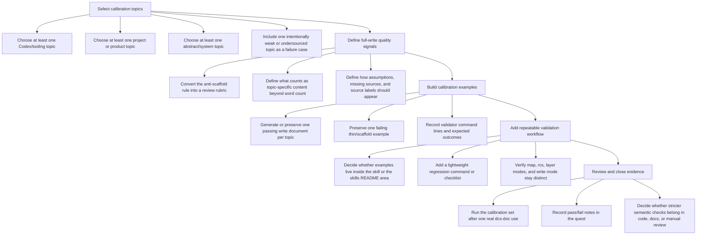
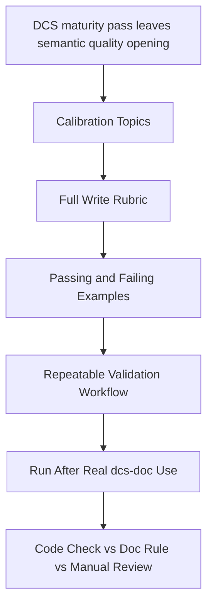

# DCS Full Write Calibration

## Objective
The DCS forge now rejects empty shells, but the next gate is subtler: prove that `write` mode produces useful topic documents across real subjects, not just sections with enough words. Build a small calibration lane with example topics, expected quality signals, failure cases, and a repeatable review loop so future `$dcs-doc` changes can be judged against actual full-write behavior.

## Tasks
- [ ] Select calibration topics
  - [ ] Choose at least one Codex/tooling topic
  - [ ] Choose at least one project or product topic
  - [ ] Choose at least one abstract/system topic
  - [ ] Include one intentionally weak or undersourced topic as a failure case
- [ ] Define full-write quality signals
  - [ ] Convert the anti-scaffold rule into a review rubric
  - [ ] Define what counts as topic-specific content beyond word count
  - [ ] Define how assumptions, missing sources, and source labels should appear
- [ ] Build calibration examples
  - [ ] Generate or preserve one passing `write` document per topic
  - [ ] Preserve one failing thin/scaffold example
  - [ ] Record validator command lines and expected outcomes
- [ ] Add repeatable validation workflow
  - [x] Decide whether examples live inside the skill or the skills README area
  - [x] Add a lightweight regression command or checklist
  - [ ] Verify `map`, `rcs`, layer modes, and `write` mode stay distinct
- [ ] Review and close evidence
  - [ ] Run the calibration set after one real `$dcs-doc` use
  - [ ] Record pass/fail notes in the quest
  - [ ] Decide whether stricter semantic checks belong in code, docs, or manual review

## Task Order Map

## Workflow Map

## Rewards
- XP: 300
- Achievement Unlocks: DCS-SYS-003
- Title Reward: Full Write Calibrator

## Completion Proof
- A small calibration set exists with passing and failing `$dcs-doc` examples.
- The anti-scaffold rule has an audit rubric that catches generic but wordy output.
- The validation workflow proves `write` is the default full-document path without breaking scaffold-only modes.
- The final notes decide whether future semantic checks should be automated or kept as manual review.

## Source Notes
- Unlocked by [DCS Doc Maturity Pass.md](F:\XP4Life\🖥 MENU\Quests\Active\DCS Doc Maturity Pass.md).
- The completed maturity pass added mechanical controls: fence handling, content sufficiency checks, source labels, note quoting, clean CLI errors, and docs alignment.
- Remaining opening: mechanical sufficiency is not the same as semantic quality.

## Notes
- Hand-authored from the findings, completions, and unlocked opening discovered during the `$dcs-doc` maturity session.
