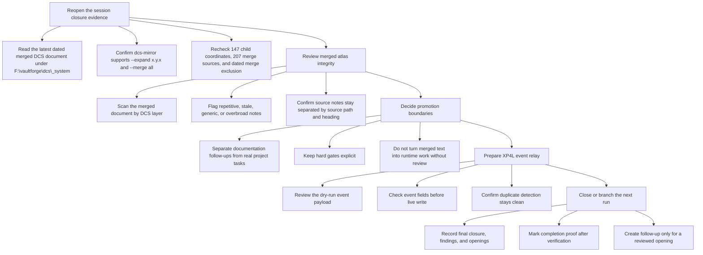
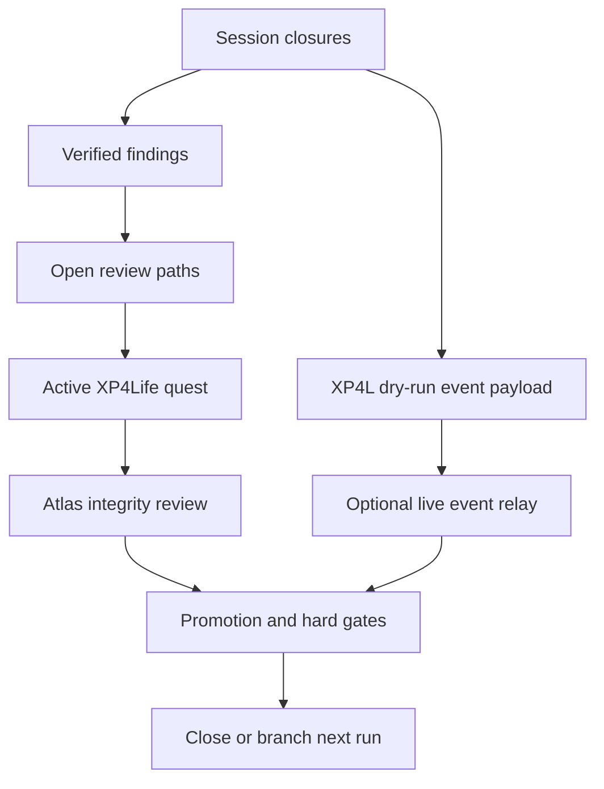

# DCS Mirror Atlas Review

## Objective
The mirror has stopped being a loose scatter of coordinate shards and now has a full dated atlas. Your mission is to inspect the bundle without mistaking it for permission to restructure VaultForge: prove the closures, name the findings, keep the openings gated, and decide which notes become real next moves.

## Tasks
- [ ] Reopen the session closure evidence
  - [ ] Read the latest dated merged DCS document under `F:\vaultforge\dcs\_system`.
  - [ ] Confirm the `dcs-mirror` skill still supports `--expand x.y.x` and `--merge all`.
  - [ ] Recheck the counts: 147 child coordinates, 207 merge sources, and dated merge files excluded from source selection.
- [ ] Review merged atlas integrity
  - [ ] Scan the merged document by DCS layer from `0_SEED` through `7_PROJECTION`.
  - [ ] Flag any note that reads repetitive, stale, generic, or too broad for its coordinate.
  - [ ] Confirm each source note remains separated by source path and section heading.
- [ ] Decide promotion boundaries
  - [x] Separate documentation-only follow-ups from root, lane, Workflow B, XP4L, or implementation tasks.
  - [ ] Keep hard gates explicit for cross-lane ownership, live generation, paid/API work, or file movement.
  - [ ] Do not turn merged DCS text into runtime work without a reviewed task or gate.
- [ ] Prepare XP4L event relay
  - [ ] Review the dry-run event payload for the completed DCS mirror work.
  - [ ] Check source, category, action, metadata, tags, and context before any live `.4` write.
  - [ ] Confirm duplicate detection stays clean if the payload is later written.
- [ ] Close or branch the next run
  - [ ] Record final closure, findings, and openings in the quest note.
  - [ ] Mark completion proof only after verification commands are rerun or accepted.
  - [ ] Create a follow-up workflow or DCS note only for a concrete reviewed opening.

## Task Order Map

## Workflow Map

## Rewards
- XP: 340
- Achievement Unlocks: VF-DCS-003
- Title Reward: Atlas Keeper I

## Completion Proof
- The latest dated merged DCS document is reviewed without including older dated merged bundles as sources.
- The `x.y.x` child coordinate grid and merge-source counts are confirmed or corrected.
- Openings are separated into documentation-only follow-ups, gated decisions, or real section tasks.
- The XP4L event payload is either kept as dry-run evidence or written live only after explicit approval.

## Source Notes
- `F:\vaultforge\dcs\_system\bounded-dcs-mirror-expansion-loop.md`
- `F:\vaultforge\dcs\_system\vaultforge-dcs-merged-2026-05-10-145314.md`
- `C:\Users\natha\.codex\skills\dcs-mirror\SKILL.md`
- `C:\Users\natha\.codex\skills\dcs-mirror\scripts\build_dcs_mirror.py`
- Session closures:
  - `--core`, `--write`, `--expand 1.x.x`, `--expand 2.x.x`, and `--expand 1.2.x` compatibility and expansion work.
  - `--expand 3.x.x` through `--expand 7.x.x` semantic layer generation.
  - `--expand x.y.x` child-coordinate generation through `x.y.3`.
  - `--merge all` dated full-document bundle generation.

## Notes
- Hand-authored from the session closures, findings, and openings using the `$create-quest-from-workflow` quest pattern.
- This quest is active and intentionally does not mark DCS review as complete yet.
