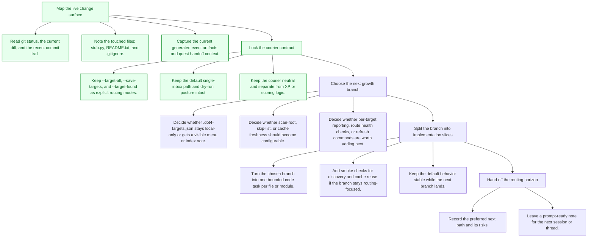
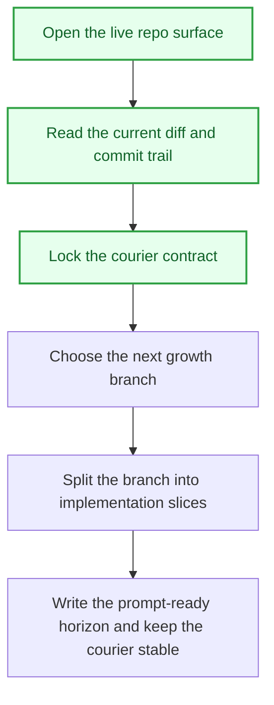

# Dot4 Courier Growth Directions

## Objective
The courier now has a real route atlas, but the path can still grow in useful ways. Read the live change surface, keep the postman posture intact, and decide which branch deserves the next build: wider discovery, clearer cache visibility, better route reporting, or a tighter handoff surface for the next session.

## Tasks
- [x] Map the live change surface
  - [x] Read `git status`, the current diff, and the recent commit trail.
  - [x] Note the touched files: `stub.py`, `README.txt`, and `.gitignore`.
  - [x] Capture the current generated event artifacts and quest handoff context.
- [x] Lock the courier contract
  - [x] Keep `--target-all`, `--save-targets`, and `--target-found` as explicit routing modes.
  - [x] Keep the default single-inbox path and dry-run posture intact.
  - [x] Keep the courier neutral and separate from XP or scoring logic.
- [ ] Choose the next growth branch
  - [ ] Decide whether `.dot4-targets.json` stays local-only or gets a visible menu or index note.
  - [ ] Decide whether scan-root, skip-list, or cache freshness should become configurable.
  - [ ] Decide whether per-target reporting, route health checks, or refresh commands are worth adding next.
- [ ] Split the branch into implementation slices
  - [ ] Turn the chosen branch into one bounded code task per file or module.
  - [ ] Add smoke checks for discovery and cache reuse if the branch stays routing-focused.
  - [ ] Keep the default behavior stable while the next branch lands.
- [ ] Hand off the routing horizon
  - [ ] Record the preferred next path and its risks.
  - [ ] Leave a prompt-ready note for the next session or thread.

## Task Order Map

## Workflow Map

## Rewards
- XP: 260
- Achievement Unlocks: VF-SYS-006
- Title Reward: Route Architect I

## Completion Proof
- The current courier change surface is mapped from the repo diff and commit trail.
- The stable routing contract is explicit in `stub.py` and `README.txt`.
- The next growth options are separated into concrete branch decisions instead of being left as vague ideas.

## Source Notes
- `F:\.4\stub.py`
- `F:\.4\README.txt`
- `F:\.4\.gitignore`
- `F:\.4\inbox\events`
- `F:\XP4Life\CODEX_START.md`
- `F:\XP4Life\README.md`
- `F:\XP4Life\🖥 MENU\Quests\Active\Dot4 Courier Route Atlas.md`

## Notes
- Recent commits in this directory point to `bb02552`, `36b099d`, `4c7bd93`, `755992a`, and `9392f37`, which trace the courier from baseline flow to route discovery and documentation.
- Hand-authored from the current terminal session using `$create-quest-from-workflow`.
- The next branch should stay routing-first and keep XP4L scoring outside the courier.
