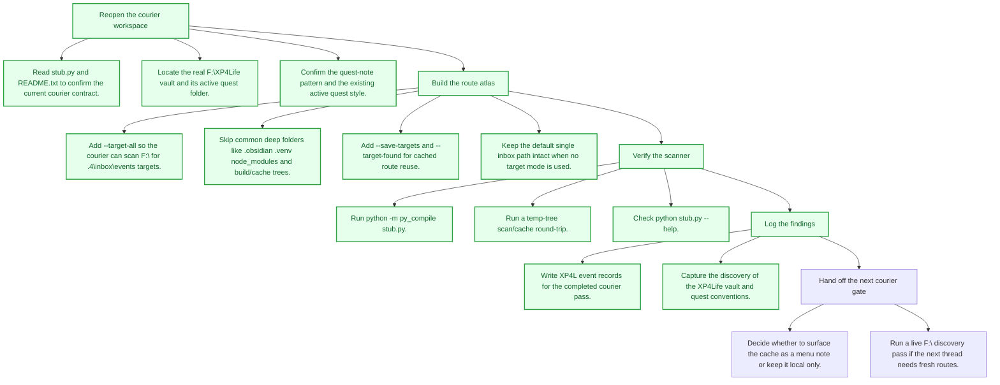
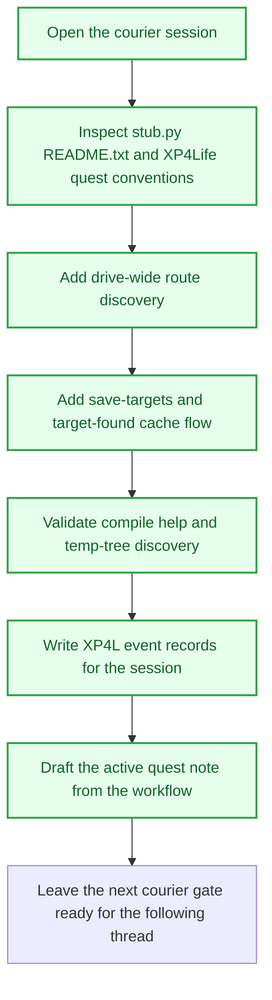

# Dot4 Courier Route Atlas

## Objective
The courier learned how to look past its first inbox. Chart the route atlas for `.4` targets across `F:\`, keep the scan honest around deep folder traps, and leave behind a cache path that lets the next run re-open discovered inboxes without paying the full search cost again.

## Tasks
- [x] Reopen the courier workspace
  - [x] Read `stub.py` and `README.txt` to confirm the current courier contract.
  - [x] Locate the real `F:\XP4Life` vault and its active quest folder.
  - [x] Confirm the quest-note pattern and the existing active quest style.
- [x] Build the route atlas
  - [x] Add `--target-all` so the courier can scan `F:\` for `.4\inbox\events` targets.
  - [x] Skip common deep folders like `.obsidian`, `.venv`, `node_modules`, and build/cache trees.
  - [x] Add `--save-targets` and `--target-found` for cached route reuse.
  - [x] Keep the default single inbox path intact when no target mode is used.
- [x] Verify the scanner
  - [x] Run `python -m py_compile stub.py`.
  - [x] Run a temp-tree scan/cache round-trip.
  - [x] Check `python stub.py --help`.
- [x] Log the findings
  - [x] Write XP4L event records for the completed courier pass.
  - [x] Capture the discovery of the XP4Life vault and quest conventions.
- [ ] Hand off the next courier gate
  - [ ] Decide whether to surface the cache as a menu note or keep it local only.
  - [ ] Run a live `F:\` discovery pass if the next thread needs fresh routes.

## Task Order Map

## Workflow Map

## Rewards
- XP: 240
- Achievement Unlocks: VF-SYS-005
- Title Reward: Route Finder I

## Completion Proof
- `stub.py` now supports `--target-all`, `--save-targets`, and `--target-found`.
- The courier was validated with compile checks, a temp-tree scan/cache round-trip, and `--help`.
- XP4L event records were written for the completed session findings.
- The real XP4Life vault and quest conventions were opened and confirmed for the follow-up quest work.

## Source Notes
- `F:\.4\stub.py`
- `F:\.4\README.txt`
- `F:\XP4Life\CODEX_START.md`
- `F:\XP4Life\Templates\New Quest.md`
- `F:\XP4Life\🖥 MENU\Quests\Active\VaultForge Decision Relay.md`
- `F:\XP4Life\🖥 MENU\Quests\Active\Quest Watcher Reliability Pass.md`

## Notes
- Hand-authored from the current terminal session using `$create-quest-from-workflow`.
- The quest stays readable as plain Markdown and keeps the courier changes separate from XP4L scoring logic.
