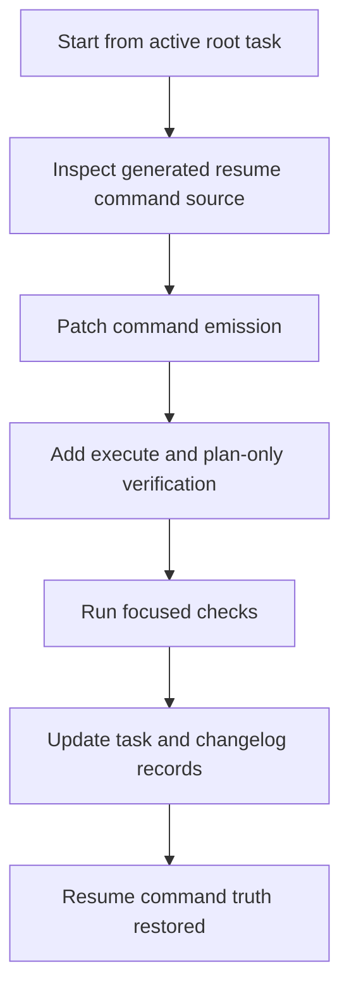

# Workflow B Resume Flag Repair

## Objective
Patch the one loose switch in the Workflow B control room. A resume command that claims execution must carry the execution flag, and the fix needs proof that plan-only and execute-mode handoffs still tell the truth.

## Tasks
- [x] Confirm the current bug shape
  - [x] Read the active root task `root-workflow-b-resume-execute-flag`.
  - [x] Inspect generated resume commands in recent Workflow B run packets.
  - [x] Identify exactly where `Execute: True` loses `--execute`.
- [ ] Patch the command builder
  - [ ] Update only the Workflow B controller or prompt/handoff code that emits resume commands.
  - [ ] Preserve existing arguments, quoting, lane selection, cycle budget, hard-gate mode, and commit mode.
- [ ] Add focused verification
  - [ ] Add or update a test for execute-mode resume command emission.
  - [ ] Add or update a test for plan-only resume command emission.
- [ ] Run checks
  - [ ] Run the Workflow B unit or smoke tests already used by the repo.
  - [ ] Run a no-execute packet generation check if safe.
- [ ] Record the repair
  - [ ] Update `TASKS.md` and `CHANGELOG.md`.
  - [ ] Note any remaining Workflow B run-packet risks separately.

## Workflow Map

## Rewards
- XP: 220
- Achievement Unlocks: VF-OPS-WFB-002
- Title Reward: Resume Keeper I

## Completion Proof
- A resume command generated from execute-mode state includes `--execute`.
- A resume command generated from plan-only state does not imply execution.
- Tests or smoke output prove both shapes.
- Root `TASKS.md` and `CHANGELOG.md` record the repair.

## Source Notes
- `F:\vaultforge\TASKS.md`
- `F:\vaultforge\MULTI_AGENT_WORKFLOW_B.md`
- `F:\vaultforge\workflow_b_controller.py`
- `F:\vaultforge\runs\workflow-b\`

## Notes
- Draft proposal generated from the current root active task pool.
- This proposal is intentionally `active`, not completed.
