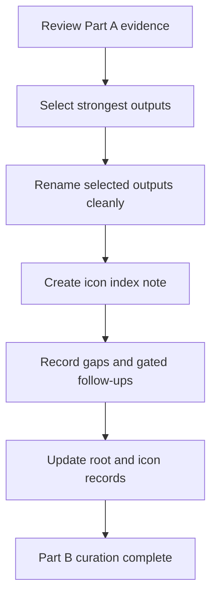

# XP4Life Icons Part B Curation

## Objective
Take the first XP4Life icon proof from raw generation into a clean usable set. The mission is selection, naming, indexing, and review discipline, not more generation unless a later approval opens that gate.

## Tasks
- [x] Reopen the Part A evidence
  - [x] Review `Icons - part A` notes, quick-use guidance, prompt banks, and output review notes.
  - [x] Confirm where generated examples and candidate outputs currently live.
- [ ] Select the strongest outputs
  - [ ] Copy only approved candidates into a scoped `selected/` location.
  - [ ] Avoid moving or deleting originals unless a separate task approves asset operations.
- [ ] Rename cleanly
  - [ ] Use readable icon names that match XP4Life surfaces such as quests, achievements, titles, rewards, dashboard, and logs.
  - [ ] Keep collision handling explicit.
- [ ] Create the icon index note
  - [ ] Embed or link selected outputs.
  - [ ] Record source prompt, category, intended use, and review notes.
- [ ] Record gaps and follow-ups
  - [ ] Mark weak categories, missing sizes, or style mismatches.
  - [ ] Split any new generation, resize, SVG conversion, or folder-icon application into separate gated tasks.
- [ ] Update root and icon records
  - [ ] Update root `TASKS.md` for `root-xp4life-part-b`.
  - [ ] Update icon or root changelog entries as appropriate.

## Workflow Map

## Rewards
- XP: 320
- Achievement Unlocks: VF-ICON-XP4L-002
- Title Reward: Icon Curator I

## Completion Proof
- A selected XP4Life icon set exists in a scoped location.
- An icon index note records names, intended surfaces, source context, and review notes.
- Any generation, resize, SVG conversion, target writes, or folder icon application remains separate unless explicitly approved.

## Source Notes
- `F:\vaultforge\TASKS.md`
- `F:\vaultforge\PLAN.md`
- `F:\vaultforge\vaultforge-icon\PLAN.md`
- `F:\vaultforge\vaultforge-icon\TASKS.md`
- `F:\vaultforge\ICON\XP4Life\part-a\`
- `F:\XP4Life\🖥 MENU\Quests\VaultForge XP4L\XP4Life Icons Part B Curation Proposal.md`

## Notes
- Promoted from the VaultForge XP4L proposal draft on 2026-05-10.
- This quest is intentionally `active`, not completed.
