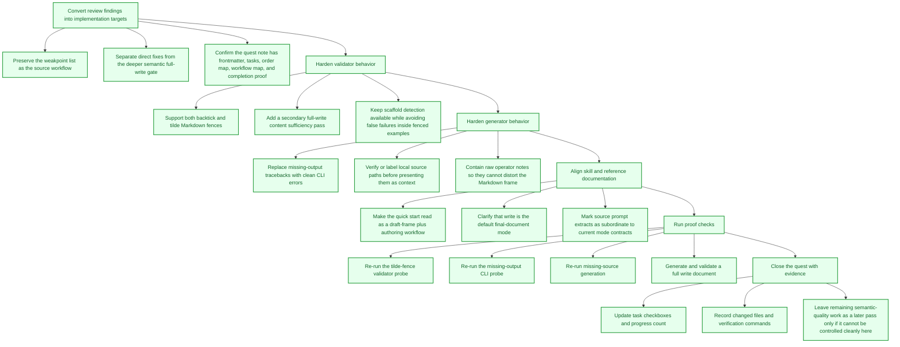
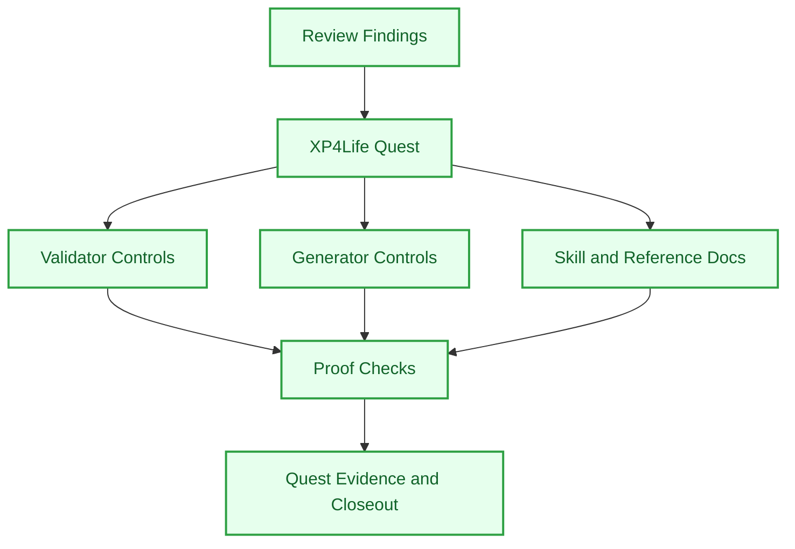

# DCS Doc Maturity Pass

## Objective
Tighten the DCS document forge so it stops handing the operator an empty coordinate shell dressed as finished work. The mission is to turn the review findings into controlled behavior: cleaner command failures, stronger source handling, safer notes, better fence parsing, a secondary full-write validation pass, and documentation that makes `write` the normal finished-document route.

## Tasks
- [x] Convert review findings into implementation targets ✅ 2026-05-10
  - [x] Preserve the weakpoint list as the source workflow ✅ 2026-05-10
  - [x] Separate direct fixes from the deeper semantic full-write gate ✅ 2026-05-10
  - [x] Confirm the quest note has frontmatter, tasks, order map, workflow map, and completion proof ✅ 2026-05-10
- [x] Harden validator behavior ✅ 2026-05-10
  - [x] Support both backtick and tilde Markdown fences ✅ 2026-05-10
  - [x] Add a secondary full-write content sufficiency pass ✅ 2026-05-10
  - [x] Keep scaffold detection available while avoiding false failures inside fenced examples ✅ 2026-05-10
- [x] Harden generator behavior ✅ 2026-05-10
  - [x] Replace missing-output tracebacks with clean CLI errors ✅ 2026-05-10
  - [x] Verify or label local source paths before presenting them as context ✅ 2026-05-10
  - [x] Contain raw operator notes so they cannot distort the Markdown frame ✅ 2026-05-10
- [x] Align skill and reference documentation ✅ 2026-05-10
  - [x] Make the quick start read as a draft-frame plus authoring workflow ✅ 2026-05-10
  - [x] Clarify that `write` is the default final-document mode ✅ 2026-05-10
  - [x] Mark source prompt extracts as subordinate to current mode contracts ✅ 2026-05-10
- [x] Run proof checks ✅ 2026-05-10
  - [x] Re-run the tilde-fence validator probe ✅ 2026-05-10
  - [x] Re-run the missing-output CLI probe ✅ 2026-05-10
  - [x] Re-run missing-source generation ✅ 2026-05-10
  - [x] Generate and validate a full `write` document ✅ 2026-05-10
- [x] Close the quest with evidence ✅ 2026-05-10
  - [x] Update task checkboxes and progress count ✅ 2026-05-10
  - [x] Record changed files and verification commands ✅ 2026-05-10
  - [x] Leave remaining semantic-quality work as a later pass only if it cannot be controlled cleanly here ✅ 2026-05-10

## Task Order Map

## Workflow Map

## Rewards
- XP: 320
- Achievement Unlocks: DCS-SYS-002
- Title Reward: Coordinate Keeper

## Completion Proof
- `$dcs-doc` skill files contain the new controls.
- Validator and generator probes prove the weakpoints are minimized or eliminated.
- A generated `write` document can be fully authored and pass the secondary full-write validation path.
- This quest note records completed tasks and verification evidence.

## Source Notes
- Review findings from the second `$dcs-doc` pass:
  - Validator cannot prove full document quality.
  - Fence handling only supports triple backticks.
  - Missing output args produce a traceback.
  - `--source` paths are not verified.
  - Helper script can still look like the final writer.
  - Reference prompt language can override current mode contracts if read loosely.
  - Raw `--notes` can distort Markdown.

## Notes
- Hand-authored from the review findings and the `$create-quest-from-workflow` quest pattern.
- Changed files:
  - `C:\Users\natha\.codex\skills\dcs-doc\SKILL.md`
  - `C:\Users\natha\.codex\skills\dcs-doc\scripts\build_dcs_doc.py`
  - `C:\Users\natha\.codex\skills\dcs-doc\scripts\validate_dcs_doc.py`
  - `C:\Users\natha\.codex\skills\dcs-doc\references\dcs-reference.md`
  - `F:\toakezg\skills-readme\DCS\dcs-doc-README.md`
- Verification:
  - `py -3 -m py_compile ...\build_dcs_doc.py ...\validate_dcs_doc.py` passed.
  - Tilde-fenced scaffold phrase with `--skip-content-check` passed.
  - Missing output args now show argparse usage instead of a Python traceback.
  - Missing local `--source` is labeled and warned as missing.
  - Thin `write` output fails the secondary content sufficiency pass.
  - Default generator mode writes `Mode: write`.
  - `map` output validates with `--mode map`.
  - Existing full document `F:\toakezg\DCS-TOPICS\Codex-Skills\codex-skills.md` passes default validation.
