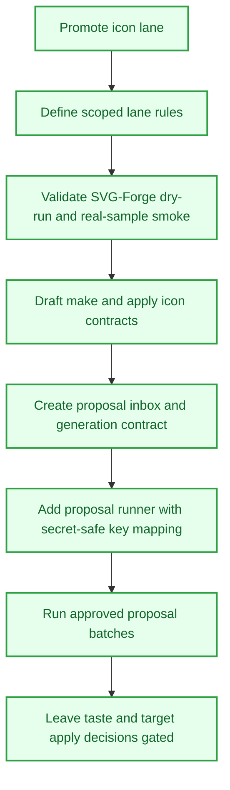

# VaultForge Icon Proposal Forge

## Objective
Turn the icon lane from scattered ideas into a scoped proposal forge: contracts first, dry-run proof first, generated assets only when approved, and final taste decisions kept with Nath.

## Tasks
- [x] Promote the icon lane
  - [x] Add `vaultforge-icon` section docs.
  - [x] Route SVG-Forge as the first active subtool.
- [x] Define lane workflow rules
  - [x] Keep Coordinator, Builder, Reviewer, and Recorder roles lightweight.
  - [x] Tag `#nath`, `#approved`, and `#live-required` clearly.
  - [x] Keep live generation, asset movement, folder icon application, and taste decisions gated.
- [x] Validate SVG-Forge safely
  - [x] Prove dry-run behavior.
  - [x] Run the explicitly approved real-sample smoke validation.
  - [x] Record exact command and output proof.
- [x] Shape the `$make-icon` and `$apply-icon` contracts
  - [x] Draft no-paid-call and no-write planning contracts.
  - [x] Park script implementation until repeated use and approval justify it.
- [x] Build the proposal inbox and runner path
  - [x] Add proposal inbox rules and icon set generation workflow contract.
  - [x] Add `run_icon_proposal.ps1` with lane-local key mapping that does not print secrets.
- [x] Complete approved proposal runs
  - [x] Finish the first inspired-agent proposal run.
  - [x] Run the Gallable launcher proposal without target writes or icon application.

## Workflow Map

## Rewards
- XP: 360
- Achievement Unlocks: VF-ICON-001, VF-CRT-ICON-001
- Title Reward: Icon Smith I

## Completion Proof
- `vaultforge-icon` docs, tasks, contracts, reviews, and decision notes define the proposal workflow.
- SVG-Forge validation and proposal runs are recorded in `vaultforge-icon\TASKS.md`.
- The Gallable proposal exists as a generated proposal run, but no target project write or folder icon application was performed.

## Source Notes
- `F:\vaultforge\vaultforge-icon\PLAN.md`
- `F:\vaultforge\vaultforge-icon\TASKS.md`
- `F:\vaultforge\THREAD_MAP.md`
- `F:\vaultforge\CHANGELOG.md`

## Notes
- Draft proposal generated from current icon-lane docs and landed proposal activity.
- This is marked `completed` for the proposal-forge setup. Gallable taste selection and any target apply work remain separate active/gated work.
