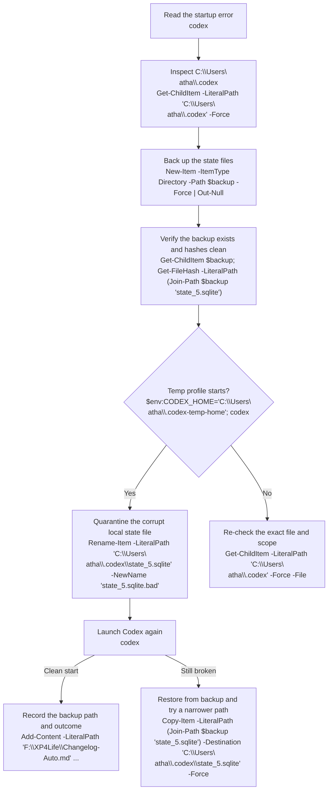

# Codex State Runtime Recovery

## Objective
Back up the Codex home state first, then isolate the malformed database with the smallest possible change, relaunch, and restore if needed.

## Tasks
- [x] Locate the live state store ✅ 2026-05-10
  - [x] Identify the exact runtime database or state file feeding the error ✅ 2026-05-10
    ```powershell
    Get-ChildItem -LiteralPath 'C:\Users\natha\.codex' -Force | Sort-Object Name | Select-Object Name, Length, LastWriteTime
    Get-ChildItem -LiteralPath 'C:\Users\natha\.codex' -Force -File | Where-Object { $_.Extension -in '.sqlite', '.sqlite3', '.db' } | Select-Object FullName, Length, LastWriteTime
    ```
  - [x] Record the owning process and the current path ✅ 2026-05-10
    ```powershell
    Get-Process codex -ErrorAction SilentlyContinue | Select-Object Id, ProcessName, Path
    Get-Location
    ```
- [x] Snapshot the state safely ✅ 2026-05-10
  - [x] Create a timestamped backup under `F:\_BACKUPS\state\` ✅ 2026-05-10
    ```powershell
    $stamp = Get-Date -Format 'yyyyMMdd-HHmmss'
    $backup = "F:\_BACKUPS\state\codex-home-$stamp"
    New-Item -ItemType Directory -Path $backup -Force | Out-Null
    Get-ChildItem -LiteralPath 'C:\Users\natha\.codex' -Force -File |
      Where-Object { $_.Name -in 'state_5.sqlite', 'logs_2.sqlite', 'logs_2.sqlite-wal', 'logs_2.sqlite-shm', 'config.toml', 'auth.json' } |
      Copy-Item -Destination $backup -Force
    ```
  - [x] Verify the backup is readable or hash-clean ✅ 2026-05-10
    ```powershell
    Get-ChildItem -LiteralPath $backup | Select-Object Name, Length, LastWriteTime
    Get-FileHash -Algorithm SHA256 -LiteralPath (Join-Path $backup 'state_5.sqlite')
    ```
- [x] Choose the least risky repair path ✅ 2026-05-10
  - [x] Prefer config-safe or migration-safe handling before direct data edits ✅ 2026-05-10
    ```powershell
    $env:CODEX_HOME = 'C:\Users\natha\.codex-temp-home'
    $env:CODEX_SQLITE_HOME = 'C:\Users\natha\.codex-temp-sqlite'
    codex
    Remove-Item Env:CODEX_HOME, Env:CODEX_SQLITE_HOME -ErrorAction SilentlyContinue
    ```
  - [x] Write the rollback step before touching the live store ✅ 2026-05-10
    ```powershell
    $rollback = "${backup}-rollback"
    Copy-Item -LiteralPath $backup -Destination $rollback -Recurse -Force
    ```
- [x] Apply the smallest fix ✅ 2026-05-10
  - [x] Make one change at a time ✅ 2026-05-10
    ```powershell
    Rename-Item -LiteralPath 'C:\Users\natha\.codex\state_5.sqlite' -NewName 'state_5.sqlite.bad'
    ```
  - [x] Re-run the runtime path and confirm the error clears ✅ 2026-05-10
    ```powershell
    codex
    if ($LASTEXITCODE -eq 0) { 'Codex state runtime started cleanly' }
    ```
- [x] Close the loop ✅ 2026-05-10
  - [x] Restore from backup if the fix misfires ✅ 2026-05-10
    ```powershell
    Copy-Item -LiteralPath (Join-Path $backup 'state_5.sqlite') -Destination 'C:\Users\natha\.codex\state_5.sqlite' -Force
    Get-ChildItem -LiteralPath $backup -Filter 'logs_2.sqlite*' | Copy-Item -Destination 'C:\Users\natha\.codex' -Force
    ```
  - [x] Record the backup path, fix, and outcome in notes or changelog ✅ 2026-05-10
    ```powershell
    Add-Content -LiteralPath 'F:\XP4Life\Changelog-Auto.md' -Value "Codex state runtime recovery backup: $backup"
    ```

## Method Map


## Task Order Map
```dataviewjs
const allTasks = dv.current().file.tasks.array();

const doneByText = Object.fromEntries(
  allTasks.map(t => [t.text.replace(/\s+/g, " ").trim(), t.completed])
);

const taskNodes = {
  "Locate the live state store": "LOCATE",
  "Identify the exact runtime database or state file feeding the error": "LOCATE_1",
  "Record the owning process and the current path": "LOCATE_2",
  "Snapshot the state safely": "BACKUP",
  "Create a timestamped backup under `F:\\_BACKUPS\\state\\`": "BACKUP_1",
  "Verify the backup is readable or hash-clean": "BACKUP_2",
  "Choose the least risky repair path": "TRIAGE",
  "Prefer config-safe or migration-safe handling before direct data edits": "TRIAGE_1",
  "Write the rollback step before touching the live store": "TRIAGE_2",
  "Apply the smallest fix": "FIX",
  "Make one change at a time": "FIX_1",
  "Re-run the runtime path and confirm the error clears": "FIX_2",
  "Close the loop": "CLOSE",
  "Restore from backup if the fix misfires": "CLOSE_1",
  "Record the backup path, fix, and outcome in notes or changelog": "CLOSE_2"
};

const doneNodes = [];
for (const [taskText, nodeId] of Object.entries(taskNodes)) {
  if (doneByText[taskText]) doneNodes.push(nodeId);
}

const completeCount = allTasks.filter(t => t.completed).length;
dv.paragraph(`Task map progress: **${completeCount}/${allTasks.length}** checklist items complete.`);

const classLine = doneNodes.length ? `    class ${doneNodes.join(",")} done;` : "";

const chart = String.raw`flowchart TD
    LOCATE[Locate the live state store] --> LOCATE_1[Identify the exact runtime database or state file feeding the error]
    LOCATE --> LOCATE_2[Record the owning process and the current path]
    LOCATE --> BACKUP[Snapshot the state safely]
    BACKUP --> BACKUP_1[Create a timestamped backup under F:\\_BACKUPS\\state\\]
    BACKUP --> BACKUP_2[Verify the backup is readable or hash-clean]
    BACKUP --> TRIAGE[Choose the least risky repair path]
    TRIAGE --> TRIAGE_1[Prefer config-safe or migration-safe handling before direct data edits]
    TRIAGE --> TRIAGE_2[Write the rollback step before touching the live store]
    TRIAGE --> FIX[Apply the smallest fix]
    FIX --> FIX_1[Make one change at a time]
    FIX --> FIX_2[Re-run the runtime path and confirm the error clears]
    FIX --> CLOSE[Close the loop]
    CLOSE --> CLOSE_1[Restore from backup if the fix misfires]
    CLOSE --> CLOSE_2[Record the backup path, fix, and outcome in notes or changelog]

    classDef done fill:#e6ffed,stroke:#2ea043,color:#116329,stroke-width:2px;
${classLine}`;

dv.paragraph("```mermaid\n" + chart + "\n```");
```

## Workflow Map
```dataviewjs
const topTasks = dv.current().file.tasks
  .where(t => !t.parent)
  .array();

const doneByText = Object.fromEntries(
  topTasks.map(t => [t.text.replace(/\s+/g, " ").trim(), t.completed])
);

const stageNodes = {
  "Locate the live state store": ["SOURCE", "SOURCE_PATH"],
  "Snapshot the state safely": ["BACKUP", "BACKUP_VERIFY"],
  "Choose the least risky repair path": ["TRIAGE", "ROLLBACK"],
  "Apply the smallest fix": ["FIX", "VERIFY"],
  "Close the loop": ["CLOSE", "PROOF"]
};

const doneNodes = [];
for (const [taskText, nodes] of Object.entries(stageNodes)) {
  if (doneByText[taskText]) doneNodes.push(...nodes);
}

const completeCount = topTasks.filter(t => t.completed).length;
dv.paragraph(`Workflow progress: **${completeCount}/${topTasks.length}** task groups complete.`);

const classLine = doneNodes.length ? `    class ${doneNodes.join(",")} done;` : "";

const chart = String.raw`flowchart TD
    START[Start from the runtime error report] --> SOURCE[Locate the live state store]
    SOURCE --> SOURCE_PATH[Identify the exact database or state file]
    SOURCE_PATH --> BACKUP[Snapshot the state safely]
    BACKUP --> BACKUP_VERIFY[Verify the backup can be trusted]
    BACKUP_VERIFY --> TRIAGE{Can the fix stay config-safe or migration-safe?}
    TRIAGE -->|Yes| ROLLBACK[Write rollback steps and keep them ready]
    TRIAGE -->|No| REVIEW[Re-check scope before touching live data]
    ROLLBACK --> FIX[Apply the smallest fix]
    REVIEW --> FIX
    FIX --> VERIFY[Re-run the runtime path]
    VERIFY -->|Error gone| PROOF[Record backup path, fix, and result]
    VERIFY -->|Still broken| RESTORE[Restore from backup and pick the next bounded fix]
    RESTORE --> SOURCE

    classDef done fill:#e6ffed,stroke:#2ea043,color:#116329,stroke-width:2px;
${classLine}`;

dv.paragraph("```mermaid\n" + chart + "\n```");
```

## Rewards
- XP: 220
- Achievement Unlocks: none
- Title Reward: Recovery Keeper I

## Completion Proof
- The live state store is identified and a timestamped backup exists under the backup root.
- The chosen repair path is recorded, and the rollback path is ready before edits.
- The runtime path is re-run and the error no longer appears, or the backup is restored cleanly if it does.

## Source Notes
- `C:\Users\natha\.codex\state_5.sqlite`
- `C:\Users\natha\.codex\logs_2.sqlite`
- `C:\Users\natha\.codex\config.toml`
- `F:\_BACKUPS`

## Notes
- Hand-authored from the current terminal request using the `$create-quest-from-workflow` quest pattern.
- This quest now tracks Codex home-state recovery, not the XP4Life state file.
- The malformed database error points at the local `C:\Users\natha\.codex` runtime state.
- Use `F:\_BACKUPS\state\` as the backup direction before touching the runtime fix.
- Command-heavy format selected by the operator.
