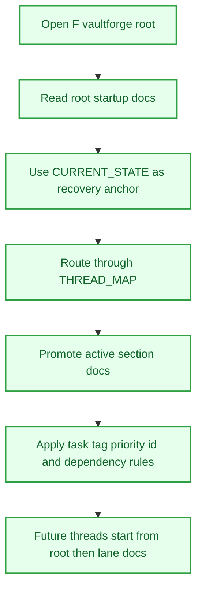

# VaultForge Root Thread Spine

## Objective
Stand at the VaultForge root and make the workspace recoverable even when the visible app history drifts. The mission is to bind startup order, routing, task rules, and section ownership into a spine that any future operator can read before touching a lane.

## Tasks
- [x] Establish the root startup spine
  - [x] Create or refresh `CODEX_START.md`, `README.md`, `SYSTEM.md`, `PLAN.md`, `TASKS.md`, and `CHANGELOG.md`.
  - [x] Keep `CURRENT_STATE.md` as the app-UI-independent recovery anchor.
- [x] Define section routing
  - [x] Record the root/section model in `THREAD_MAP.md`.
  - [x] Split work between root, engine, business, coding, XP4L, art, and icon lanes.
- [x] Promote active worker bases
  - [x] Promote `vaultforge-coding`, `vaultforge-xp4l`, and `vaultforge-icon` with section docs.
  - [x] Keep parked folders explicitly parked until root promotes them.
- [x] Standardize task hygiene
  - [x] Add section tags, task-type tags, priority markers, stable ids, recurring markers, and dependency links.
  - [x] Keep automatic Tasks queries above manual pools.
- [x] Capture follow-up direction
  - [x] Keep root as coordinator rather than worker space.
  - [x] Route future lane work through section docs and changelogs.

## Workflow Map

## Rewards
- XP: 300
- Achievement Unlocks: VF-SYS-ROOT-001
- Title Reward: Thread Cartographer I

## Completion Proof
- Root docs exist and define read order, current state, task pools, routing, and changelog history.
- `THREAD_MAP.md` routes active lanes and names parked/supporting folders.
- `TASKS.md` includes both active/open work and landed structural work.

## Source Notes
- `F:\vaultforge\CODEX_START.md`
- `F:\vaultforge\CURRENT_STATE.md`
- `F:\vaultforge\THREAD_MAP.md`
- `F:\vaultforge\PLAN.md`
- `F:\vaultforge\TASKS.md`
- `F:\vaultforge\CHANGELOG.md`

## Notes
- Draft proposal generated from current VaultForge docs and prior activity.
- This proposal is marked `completed` because the root thread spine already exists; remaining maintenance should become separate recurring quests or tasks.
