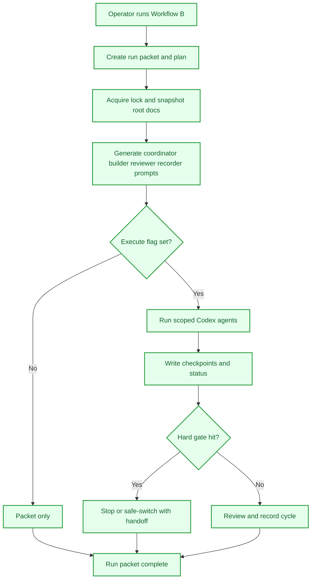

# Workflow B Control Tower

## Objective
Raise the long-run control tower for VaultForge: a controller that plans cycles, keeps lanes scoped, logs checkpoints, respects hard gates, and leaves a durable packet after every run.

## Tasks
- [x] Define the long-run workflow
  - [x] Write `MULTI_AGENT_WORKFLOW_B.md` as the controller guide for repeated Coordinator, Builder, Reviewer, Recorder cycles.
  - [x] Keep Workflow A as the role order that Workflow B repeats.
- [x] Build the controller surface
  - [x] Add `workflow_b_controller.py`.
  - [x] Add `run_workflow_b.bat` and `run_workflow_b_watch.bat`.
  - [x] Write run packets under `runs/workflow-b/`.
- [x] Add planning and execution modes
  - [x] Support default plan-only packet generation.
  - [x] Support explicit `--execute` for Codex CLI launches.
  - [x] Support lane selection, cycles, parallel mode, and commit policy.
- [x] Add budgets and checkpoints
  - [x] Add cycle, timebox, estimated usage, and agent budget controls.
  - [x] Write `status.jsonl`, `checkpoints.jsonl`, and `workflow-b-live-status.md`.
- [x] Add hard-gate behavior
  - [x] Record stop, safe-switch, or continue behavior for gated actions.
  - [x] Keep live generation, paid/API work, publication, pricing, licensing, asset moves, and ownership changes behind approvals.
- [x] Add review and refresh behavior
  - [x] Watch workflow docs and refresh prompts when guidance changes.
  - [x] Maintain `WORKFLOW_REVIEW.md` as the controller health surface.
- [x] Add cancellation and failure handoffs
  - [x] Write cancellation handoffs on Ctrl+C.
  - [x] Write error guides for launch, sandbox, CLI, or plugin failures.

## Workflow Map

## Rewards
- XP: 480
- Achievement Unlocks: VF-SYS-WFB-001, VF-OPS-WFB-001
- Title Reward: Run Controller I

## Completion Proof
- `MULTI_AGENT_WORKFLOW_B.md`, `workflow_b_controller.py`, `run_workflow_b.bat`, and `run_workflow_b_watch.bat` exist.
- Workflow B run records are captured in root changelog entries dated 2026-05-09 and 2026-05-10.
- Controller output includes plan packets, checkpoints, live status, stop handoffs, cancel handoffs, and failure guides.

## Source Notes
- `F:\vaultforge\MULTI_AGENT_WORKFLOW_B.md`
- `F:\vaultforge\workflow_b.md`
- `F:\vaultforge\WORKFLOW_REVIEW.md`
- `F:\vaultforge\workflow_b_controller.py`
- `F:\vaultforge\CHANGELOG.md`

## Notes
- Draft proposal generated from current VaultForge Workflow B docs and landed changelog activity.
- This is marked `completed` for the controller foundation. The open resume-command `--execute` flag bug should stay a separate active quest or task.
