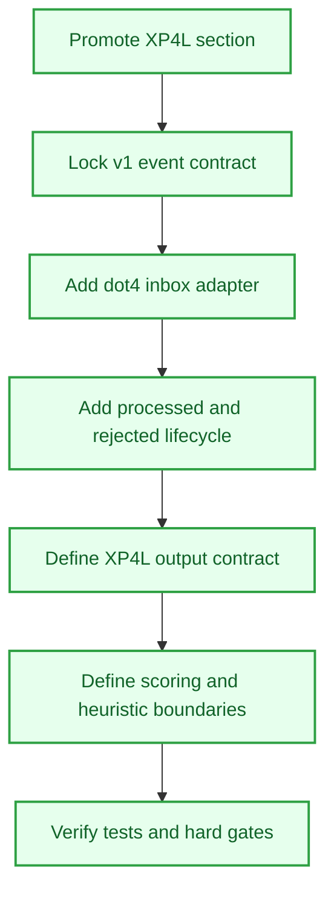

# XP4L Contract Spine

## Objective
Set XP4L apart as the meaning layer, not the execution lane. Lock the event contract, keep scoring surfaces inspectable, define output shape, and make vault writes reviewable before deeper progression logic grows.

## Tasks
- [x] Activate the XP4L section
  - [x] Add section docs and root routing for `vaultforge-xp4l`.
  - [x] Keep the section focused on interpretation, progression, quests, achievements, and dashboard-ready outputs.
- [x] Lock the event input contract
  - [x] Define neutral upstream event fields.
  - [x] Add canonical valid and invalid fixtures.
  - [x] Keep unknown top-level fields rejected.
- [x] Add `.4` intake
  - [x] Normalize structured `.4` JSON batches into the stable XP4L v1 event contract.
  - [x] Keep dry-run behavior intact.
  - [x] Add processed and rejected lifecycle handling.
- [x] Define output and vault surfaces
  - [x] Document XP awards, quest updates, achievements, rewards, metrics, and vault-injection targets.
  - [x] Keep dashboard fields reviewable and Dataview-ready.
- [x] Define rule and heuristic boundaries
  - [x] Separate scoring ownership from execution-lane behavior.
  - [x] Keep contribution, rarity, achievement, reward, and prestige logic inspectable.
- [x] Verify the section behavior
  - [x] Keep unit tests green.
  - [x] Record hard gates for scoring changes, parser changes, persistent progression changes, and live vault writes.

## Workflow Map

## Rewards
- XP: 420
- Achievement Unlocks: VF-XP4L-001, VF-SYS-XP4L-001
- Title Reward: Progression Scribe I

## Completion Proof
- `vaultforge-xp4l` is active in root routing and has its own docs-first section pack.
- XP4L task records show event contract, output contract, rule surface, heuristic boundaries, verification criteria, and vault output shape completed.
- Workflow B records show XP4L docs and tests passing without live vault writes or scoring behavior changes.

## Source Notes
- `F:\vaultforge\THREAD_MAP.md`
- `F:\vaultforge\vaultforge-xp4l\PLAN.md`
- `F:\vaultforge\vaultforge-xp4l\TASKS.md`
- `F:\vaultforge\CHANGELOG.md`
- `F:\XP4Life\🖥 MENU\Quests\VaultForge XP4L\XP4L Contract Spine Proposal.md`

## Notes
- Promoted from the VaultForge XP4L proposal draft on 2026-05-10.
- This quest is marked `completed` for the contract and documentation spine; future runtime scoring or vault-write work should be its own quest.
